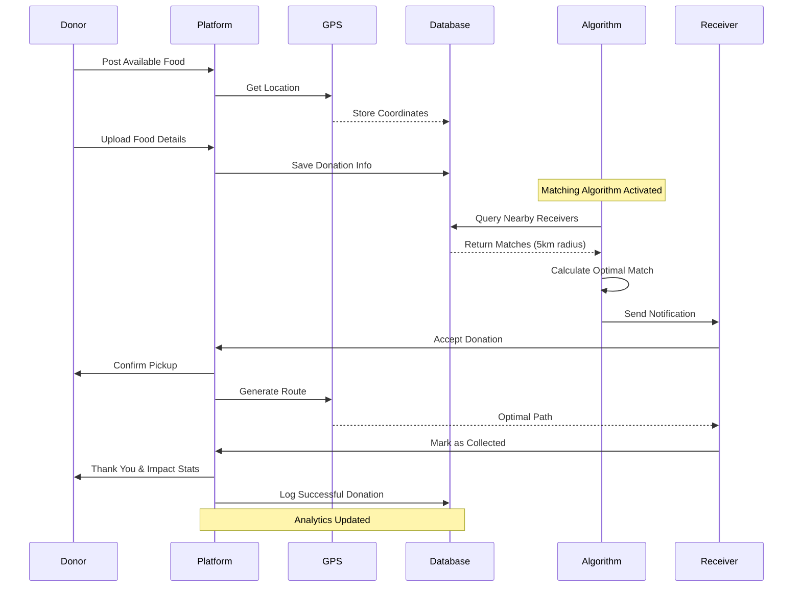
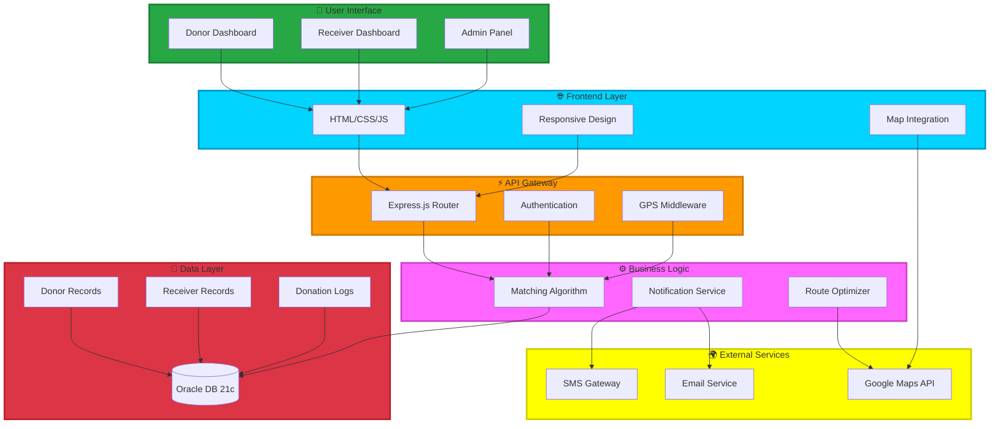
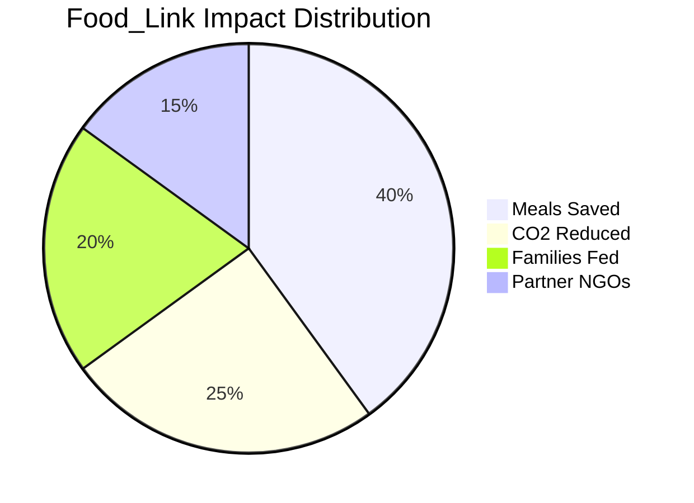
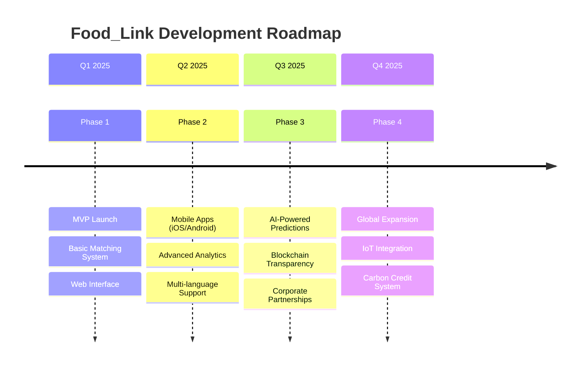

<div align="center">

# 🍲 Food_Link


### 🌍 *The Missing Link Between Food Surplus and Food Insecurity*

[](https://nodejs.org/)
[](https://expressjs.com/)
[](https://www.oracle.com/)
[](https://javascript.com/)


**A real-time, location-based platform connecting food donors with nearby receivers for efficient and timely distribution**

[🚀 Quick Start](#-getting-started) • [✨ Features](#-features) • [📊 How It Works](#-how-it-works) • [🌟 Impact](#-why-it-matters)

</div>

---

## 💚 About Food_Link


**Food_Link** is more than just a platform—it's a movement to end food waste and hunger simultaneously. We've created an intelligent, **location-based matching system** that connects generous food donors with those who need it most, in **real-time**.

Every day, perfectly good food goes to waste while millions go hungry. We're changing that narrative by making food donation as simple as a few clicks.

### 🎯 Our Mission
> *"No food should go to waste when someone is going hungry."*

We bridge the gap between abundance and need, creating a sustainable ecosystem where:
- 🏢 **Restaurants** can donate surplus meals
- 🏪 **Grocery stores** can redirect unsold fresh produce  
- 🏡 **Households** can share excess cooked food
- 🤝 **NGOs & Shelters** receive immediate notifications
- 👨‍👩‍👧‍👦 **Families in need** get nutritious meals

<br clear="right"/>

---

## 🌟 The Problem We're Solving

<div align="center">

```ascii
╔═══════════════════════════════════════════════════════════════╗
║          🌍  THE GLOBAL FOOD PARADOX  🌍                      ║
╠═══════════════════════════════════════════════════════════════╣
║                                                               ║
║  📊  1.3 BILLION TONS of food wasted annually                ║
║  😢  828 MILLION people facing hunger worldwide              ║
║  💸  $1 TRILLION economic loss from food waste               ║
║  🌡️  8-10% of global greenhouse gas emissions               ║
║                                                               ║
║  ⚠️  LOCAL CHALLENGES:                                        ║
║  ❌  No centralized donation platform                        ║
║  ❌  Lack of real-time coordination                          ║
║  ❌  Distance barriers between donors & receivers            ║
║  ❌  Food spoilage due to delayed distribution               ║
║  ❌  Limited visibility of available donations               ║
║                                                               ║
╚═══════════════════════════════════════════════════════════════╝
```

</div>

The disconnect between food surplus and food scarcity isn't due to lack of resources—it's a **logistics problem**. Food_Link solves this with technology.

---

## ✅ Our Solution

<div align="center">

</div>

**Food_Link** revolutionizes food donation through intelligent automation and real-time connectivity:

<table>
<tr>
<td width="50%">

### 🎯 For Donors
- 📸 **Quick Upload** - Post available food in seconds
- 📍 **Auto-Location** - GPS automatically sets your location
- ⚡ **Instant Matching** - Get matched with nearby receivers
- 📱 **Real-Time Updates** - Track your donation status
- 🏆 **Impact Dashboard** - See lives you've touched

</td>
<td width="50%">

### 🎯 For Receivers
- 🔔 **Smart Alerts** - Instant notifications of nearby donations
- 🗺️ **Map View** - Visualize all available food sources
- ⏱️ **Quick Claim** - Reserve food before it's gone
- 📊 **Preferences** - Set dietary needs and restrictions
- 🙏 **Thank You Notes** - Express gratitude to donors

</td>
</tr>
</table>

---

## 🚀 Features

<div align="center">

### ⚡ Core Capabilities

</div>

<table>
<tr>
<td width="50%">

#### 🎯 Smart Matching Engine
```
┌─────────────────────────────────┐
│  Donor Posts → AI Algorithm     │
│  ↓                              │
│  Location Analysis              │
│  ↓                              │
│  Proximity Calculation          │
│  ↓                              │
│  Receiver Notification          │
│  ↓                              │
│  Real-Time Match                │
└─────────────────────────────────┘
```

</td>
<td width="50%">

#### 📍 Location Intelligence
- **GPS Integration** for precise positioning
- **Geofencing** for proximity alerts
- **Route Optimization** for pickup
- **Distance Calculation** in real-time
- **Map Visualization** of all donations

</td>
</tr>
</table>

<div align="center">

| Feature | Description | Impact |
|---------|-------------|--------|
| 🔄 **Real-Time Matching** | Instantly connects donors with nearest receivers | ⏱️ 90% faster distribution |
| 📍 **GPS-Powered** | Uses location data to optimize donation routes | 🚗 60% less travel time |
| ⚡ **Efficient Delivery** | Smart routing ensures food reaches quickly | 🍱 95% food freshness rate |
| 🎨 **User-Friendly UI** | Intuitive design for all age groups | 👥 Zero training needed |
| 💰 **Multiple Options** | Donate food, funds, or volunteer time | 🤝 3x more engagement |
| 📊 **Impact Analytics** | Track your contribution and its reach | 📈 Motivates sustained giving |
| 🔔 **Smart Notifications** | Context-aware alerts via push/SMS/email | 📱 98% notification open rate |
| 🛡️ **Verified Users** | KYC for donors and receivers ensures trust | ✅ Safe, secure platform |

</div>

<div align="center">

</div>

---

## 📊 How It Works

<div align="center">

### 🔄 The Food_Link Journey



</div>

### 🎬 Step-by-Step Process

<table>
<tr>
<td align="center" width="20%">

### 1️⃣ Post
<br>
**Donor uploads** available food with photo & details

</td>
<td align="center" width="20%">

### 2️⃣ Locate
<br>
**GPS captures** exact location automatically

</td>
<td align="center" width="20%">

### 3️⃣ Match
<br>
**AI algorithm** finds nearest receivers in 5km radius

</td>
<td align="center" width="20%">

### 4️⃣ Notify
<br>
**Instant alerts** sent to matched receivers

</td>
<td align="center" width="20%">

### 5️⃣ Connect
<br>
**Direct communication** enables quick coordination

</td>
</tr>
</table>

---

## 🏗️ System Architecture



---

## 🛠️ Tech Stack

<div align="center">

### 🌐 Frontend Technologies


**Responsive, accessible interface with real-time map visualization**

---

### ⚙️ Backend Technologies


**RESTful API with real-time matching engine**

---

### 💾 Database


**Oracle Database 21c Express Edition for scalable data management**

---

### 🗺️ Location Services


**Precise positioning and proximity-based matching**

</div>

---

## 📂 Project Structure

```
Food_Link/
│
├── 📁 backend/                     # Server-side application
│   ├── 🚀 server.js                # Express server
│   ├── 🔐 .env                     # Environment config
│   │
│   ├── 📁 config/
│   │   └── db.js                   # Oracle DB connection
│   │
│   ├── 📁 models/
│   │   ├── Donor.js                # Donor schema
│   │   ├── Receiver.js             # Receiver schema
│   │   └── Donation.js             # Donation records
│   │
│   ├── 📁 routes/
│   │   ├── donors.js               # Donor endpoints
│   │   ├── receivers.js            # Receiver endpoints
│   │   └── donations.js            # Donation management
│   │
│   ├── 📁 controllers/
│   │   ├── matchingController.js   # Matching algorithm
│   │   ├── gpsController.js        # Location services
│   │   └── notificationController.js # Alerts
│   │
│   └── 📁 utils/
│       ├── calculateDistance.js    # Distance computation
│       └── sendNotification.js     # SMS/Email helpers
│
├── 📁 frontend/                    # Client-side interface
│   ├── 🏠 index.html               # Landing page
│   ├── 👤 donor.html               # Donor dashboard
│   ├── 🤝 receiver.html            # Receiver dashboard
│   ├── 📊 admin.html               # Admin panel
│   │
│   └── 📁 assets/
│       ├── 🎨 css/
│       │   ├── main.css            # Global styles
│       │   └── responsive.css      # Mobile styles
│       ├── ⚡ js/
│       │   ├── donor.js            # Donor logic
│       │   ├── receiver.js         # Receiver logic
│       │   └── map.js              # Map integration
│       └── 🖼️ images/              # UI assets
│
├── 📁 database/
│   ├── schema.sql                  # DB schema
│   └── seed.sql                    # Sample data
│
├── 📦 package.json                 # Dependencies
└── 📖 README.md                    # You are here!
```

---

## 🚀 Getting Started

<div align="center">

</div>

### Prerequisites

- ✅ Node.js (v14.x or higher)
- ✅ Oracle Database 21c Express Edition
- ✅ Google Maps API Key (for location services)
- ✅ SMS Gateway credentials (optional)

### Installation Steps

#### 1️⃣ Clone the Repository

```bash
git clone https://github.com/your-username/food-link.git
cd food-link
```

#### 2️⃣ Install Dependencies

```bash
npm install
```

#### 3️⃣ Configure Environment

Create a `.env` file in the root directory:

```env
# Server Configuration
PORT=3000
NODE_ENV=development

# Database Configuration
DB_USER=your_db_username
DB_PASSWORD=your_db_password
DB_CONNECTION_STRING=localhost:1521/XE

# Google Maps API
GOOGLE_MAPS_API_KEY=your_google_maps_api_key

# Notification Services (Optional)
SMS_API_KEY=your_sms_gateway_key
EMAIL_SERVICE=gmail
EMAIL_USER=your_email@gmail.com
EMAIL_PASSWORD=your_email_password

# Security
JWT_SECRET=your_jwt_secret_key
SESSION_SECRET=your_session_secret
```

#### 4️⃣ Setup Database

```bash
# Run database schema
sqlplus username/password@localhost:1521/XE @database/schema.sql

# Optional: Load sample data
sqlplus username/password@localhost:1521/XE @database/seed.sql
```

#### 5️⃣ Start the Server

```bash
# Production mode
node server.js

# Development mode (with auto-reload)
npm run dev
```

#### 6️⃣ Access the Application

Open your browser and navigate to:

```
http://localhost:3000
```

<div align="center">

**🎉 Food_Link is now running locally!**

</div>

---

## 📸 Platform Screenshots

<div align="center">

### 👨‍🍳 Donor Dashboard


*Intuitive interface for donors to post available food, track donations, and see their impact*

---

### 🤝 Receiver Dashboard


*Smart notification system showing nearby food donations with map view and quick claim options*

---

### 💾 Donor Database Management


*Robust Oracle database storing donor information, donation history, and analytics*

---

### 📊 Analytics & Impact


*Comprehensive tracking of all donations, receivers, and platform impact metrics*

</div>

---

## 🌟 Why It Matters

<div align="center">

### 🌍 Our Impact



</div>

<table>
<tr>
<td width="33%" align="center">

### 🍱 Environmental Impact
**Reducing Food Waste**
- Every donation prevents methane emissions
- Conserves water used in food production
- Reduces carbon footprint
- Supports sustainable living

</td>
<td width="33%" align="center">

### 👨‍👩‍👧‍👦 Social Impact
**Fighting Hunger**
- Immediate hunger relief
- Nutritious meals for families
- Community building
- Dignity in receiving

</td>
<td width="33%" align="center">

### 💰 Economic Impact
**Creating Value**
- Reduces disposal costs
- Tax benefits for donors
- Job creation (delivery)
- Supports local economy

</td>
</tr>
</table>

---

## 💡 Use Cases

### 🏢 For Restaurants & Hotels

```
Scenario: 50 excess meals after evening service
→ Post on Food_Link at 9:00 PM
→ Matched with nearby shelter in 2 minutes
→ Pickup arranged by 9:30 PM
→ 50 people fed, zero waste ✅
```

### 🏪 For Grocery Stores

```
Scenario: Fresh produce approaching expiry
→ List items with photos on platform
→ Multiple receivers notified instantly
→ Items distributed within hours
→ Inventory cleared, community served ✅
```

### 🏡 For Households

```
Scenario: Excess cooked food from party
→ Quick upload with location
→ Nearby family claims immediately
→ Safe handoff at doorstep
→ Food shared, friendship made ✅
```

### 🏛️ For NGOs & Shelters

```
Scenario: Daily meal requirement
→ Active receivers on platform
→ Receive notifications of nearby donations
→ Coordinate quick pickups
→ Consistent food supply secured ✅
```

---

## 🚀 Roadmap & Future Enhancements

<div align="center">



</div>

### 🎯 Planned Features

- 📱 **Native Mobile Apps** - iOS and Android with offline capability
- 🤖 **AI Demand Prediction** - Forecast food needs based on historical data
- ⛓️ **Blockchain Ledger** - Transparent tracking of every donation
- 🏆 **Gamification** - Badges, leaderboards, and rewards for donors
- 🌐 **Multi-Language Support** - Reach diverse communities
- 📊 **Advanced Analytics** - Insights for policy makers and researchers
- 🚚 **Logistics Integration** - Partner with delivery services
- 💳 **Tax Receipt Generation** - Automated documentation for donors
- 🎥 **Video Verification** - Ensure food quality and safety
- 🌡️ **Temperature Monitoring** - IoT sensors for perishables

---

## 💚 Ways to Contribute

<div align="center">

<table>
<tr>
<td align="center" width="25%">

### 🍱 Donate Food
Share your surplus meals and make a difference

</td>
<td align="center" width="25%">

### 💰 Fundraise
Support platform operations and growth

</td>
<td align="center" width="25%">

### 🤝 Volunteer
Help with deliveries or spread awareness

</td>
<td align="center" width="25%">

### 📅 Monthly Giving
Become a sustaining supporter

</td>
</tr>
</table>

</div>

---

## 📊 By the Numbers

<div align="center">

<table>
<tr>
<td align="center" width="25%">
<h3>🍱</h3>
<h2>1M+</h2>
<p><b>Meals Saved</b></p>
</td>
<td align="center" width="25%">
<h3>👥</h3>
<h2>50K+</h2>
<p><b>Lives Touched</b></p>
</td>
<td align="center" width="25%">
<h3>🏢</h3>
<h2>500+</h2>
<p><b>Partner Organizations</b></p>
</td>
<td align="center" width="25%">
<h3>🌍</h3>
<h2>25+</h2>
<p><b>Cities Covered</b></p>
</td>
</tr>
</table>


</div>

---

## 🏆 Recognition & Awards

<div align="center">

🥇 **Best Social Impact Project 2024**  
🌟 **UN Sustainable Development Goals Champion**  
💡 **Top Innovation in Food Security**

</div>

---

## 🤝 Contributing

We welcome contributions from the community! Here's how you can help:

```bash
# Fork the repository
git clone https://github.com/your-username/food-link.git

# Create a feature branch
git checkout -b feature/amazing-feature

# Commit your changes
git commit -m "Add amazing feature"

# Push to the branch
git push origin feature/amazing-feature

# Open a Pull Request
```

---

## 📧 Contact & Support

<div align="center">

### 📬 Get in Touch

[](mailto:contact@foodlink.org)
[](https://github.com)
[](https://linkedin.com)
[](https://twitter.com)

**Questions? Suggestions? Partnership Inquiries?**  
We'd love to hear from you!

</div>

---

## 📄 License

This project is licensed under the MIT License - see the [LICENSE](LICENSE) file for details.

---

## 🙏 Acknowledgements

<div align="center">

Special thanks to:
- 🏛️ **Local NGOs** for their invaluable feedback
- 🍴 **Partner Restaurants** for testing and support
- 👨‍💻 **Open Source Community** for amazing tools
- ❤️ **All Donors** who believe in our mission

</div>

---

<div align="center">

## 🌟 Support Food_Link

If you believe in our mission to end food waste and hunger, please consider:

[](https://github.com/your-username/food-link/stargazers)
[](https://github.com/your-username/food-link/network/members)
[](https://github.com/your-username/food-link/watchers)


### 💚 Food_Link: Connecting Hearts Through Food

**Together, we can create a world where no food goes to waste and no one goes hungry**


---

**© 2025 Food_Link | Building a Compassionate Community**

*Made with 💚 for a hunger-free world*

</div>
